# Herramientas Kae - Librería ER para Draw.io

Este proyecto es una librería de formas personalizadas diseñada específicamente para crear **Diagramas Entidad-Relación (ER)** de forma rápida y visual en [Draw.io](https://app.diagrams.net/) (también conocido como diagrams.net).

Olvídate de dibujar formas desde cero o de buscar el símbolo correcto. Con esta librería, solo tienes que **arrastrar y soltar** los elementos pre-diseñados para construir tus modelos de datos de manera eficiente y con una nomenclatura clara y profesional.

## ¿Cómo Instalarlo?

Es muy sencillo. Sigue estos pasos:

1. **Descarga** el archivo `HerramientasKae.xml` de este repositorio.
2. Abre [Draw.io](https://app.diagrams.net/) (o tu instancia local de escritorio).
3. Ve al menú: `Archivo` > `Abrir librería desde...` > `Dispositivo...`.
4. Selecciona el archivo `.xml` que descargaste.
5. ¡Listo! Aparecerá una nueva pestaña en tu barra lateral izquierda llamada "HerramientasKae" con todas las formas listas para usar.

> **Consejo:** Puedes arrastrar la pestaña de la nueva librería fuera del panel lateral para tener una ventana flotante con tus herramientas siempre a mano.

## Guía de Uso: Símbolos y su Significado

Aquí te explico cada uno de los elementos disponibles y cómo usarlos en tus diagramas.

### Entidades y Relaciones

Son los bloques fundamentales de cualquier diagrama ER.

| Icono | Nombre en la Librería | Descripción |
| :---: | :---: | :--- |
| 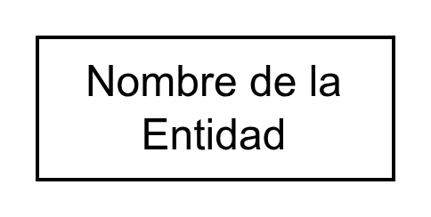 | `entidad` | Representa un **objeto o concepto del mundo real** (ej. Cliente, Producto, Empleado). Es un rectángulo clásico de entidad. |
| 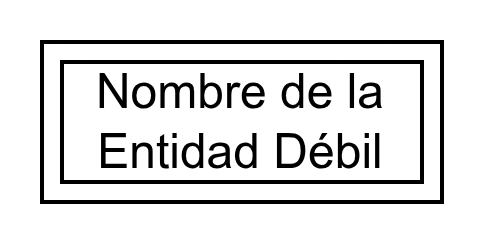 | `entidad_debil` | Una **entidad débil**, que no puede existir sin la entidad de la que depende (ej. Línea de Pedido, que depende de Pedido). Se representa con un doble rectángulo. |
| 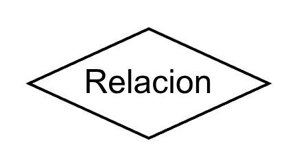 | `relacion` | Simboliza la **asociación** entre dos o más entidades (ej. "Compra" entre Cliente y Producto). Es un rombo. |
| 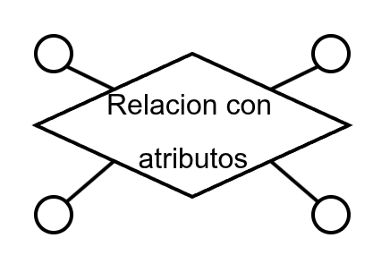 | `relacion_atributos` | Una relación que también posee sus propios **atributos** (ej. la relación "Trabaja" entre Empleado y Proyecto podría tener el atributo "Horas"). |

### Atributos

Detallan las propiedades de las entidades y relaciones.

| Icono | Nombre en la Librería | Descripción |
| :---: | :---: | :--- |
|  | `atributo` | El **atributo estándar** (ej. Nombre, Fecha, Precio). Es un círculo. |
|  | `clave_primaria` | Un atributo que es **clave primaria** (identifica de forma única a la entidad, ej. ID_Cliente). Se representa con un círculo con el nombre subrayado. |
|  | `atributo_multivaluado` | Un atributo que puede tener **múltiples valores** para una misma entidad (ej. Teléfonos de un Cliente). Es un doble círculo. |
| 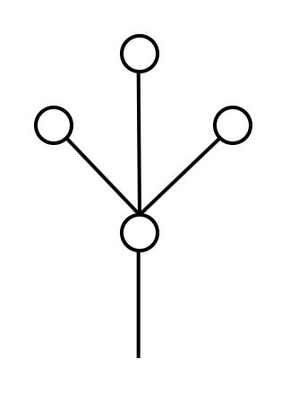 | `atributo_compuesto` | Un atributo que se puede dividir en sub-atributos (ej. Dirección se compone de Calle, Ciudad, CP). |
|  | `atributo_derivado` | Un atributo cuyo valor se puede **calcular** a partir de otros atributos (ej. Edad se deriva de Fecha_Nacimiento). Se representa con un círculo con línea discontinua. |
| *Posiciones* | `atributo_...` | Los atributos como `atributo_inferior_derecha`, `atributo_superior_izquierda`, etc., son simplemente **versiones pre-posicionadas** para facilitar la conexión visual alrededor de una entidad. Puedes usar el que mejor se adapte a la dirección de tu línea de conexión. |
|  | `variable` | Un símbolo genérico que puede servir para representar otros elementos o anotaciones. |

### Cardinalidades y Conexiones

Define cómo participan las entidades en las relaciones.

| Icono | Nombre en la Librería | Descripción |
| :---: | :---: | :--- |
| 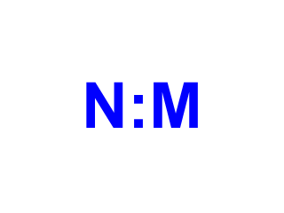 | `cardinalidad_horizontal` | Para indicar la cardinalidad (1:1, 1:N, N:M) en conexiones **horizontales**. Contiene texto como "1" o "N". |
| 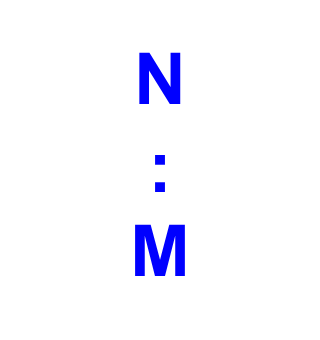 | `cardinalidad_vertical` | Similar al anterior, pero para conexiones **verticales**. |
| 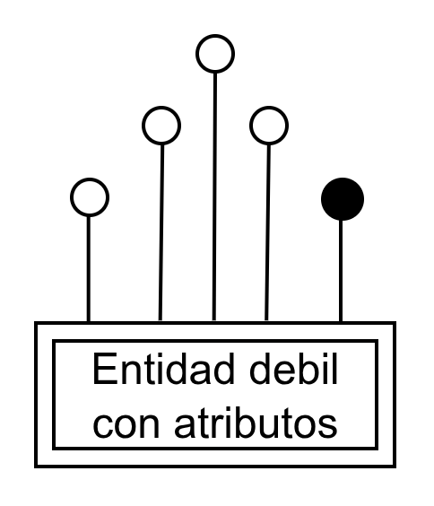 | `debil_atributos` | Un conector especial que une una entidad débil con su entidad fuerte, típicamente a través de sus atributos. |

### Jerarquías (Especialización/Generalización)

Para modelar herencia o subtipos. Las restricciones se basan en si las subclases pueden solaparse y si cubren todos los casos.

| Icono | Nombre en la Librería | Descripción |
| :---: | :---: | :--- |
| 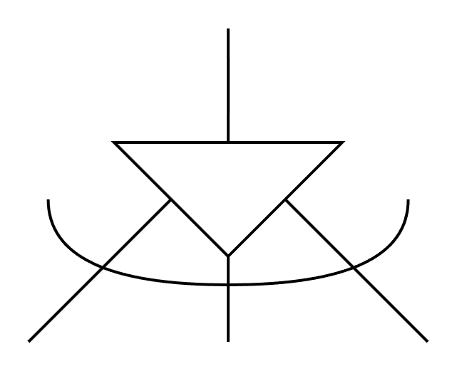 | `exclusiva_parcial` | **Exclusiva y Parcial**: Una entidad puede ser un subtipo, pero no es obligatorio. Si lo es, pertenece a **solo uno** de ellos (ej. Cuenta (Ahorros o Corriente), una cuenta puede no ser de ahorros ni corriente). |
|  | `exclusiva_total` | **Exclusiva y Total**: Cada entidad de la superclase **debe ser** un subtipo, y solo puede ser **uno** de ellos (ej. Empleado (JornadaCompleta o MedioTiempo), todos los empleados son uno de estos dos tipos, y no pueden ser ambos). |
| 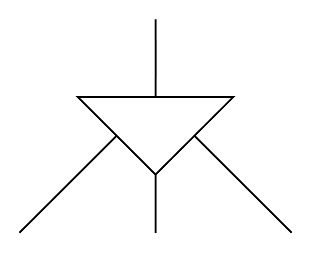 | `solapada_parcial` | **Solapada y Parcial**: Una entidad puede ser un subtipo, pero no es obligatorio. Puede pertenecer a **varios** de ellos a la vez (ej. Persona (Estudiante o Empleado), una persona puede ser estudiante, empleado, ambos o ninguno). |
| 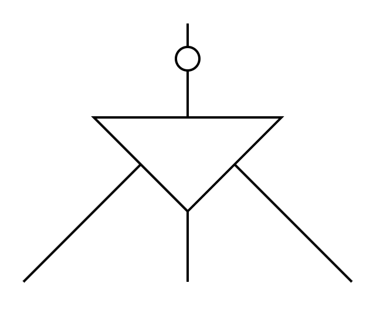 | `solapada_total` | **Solapada y Total**: Cada entidad de la superclase **debe ser** al menos un subtipo, pudiendo pertenecer a **varios** (ej. Producto (Comestible o Electrónico), todos los productos son o comestibles, o electrónicos, o ambos si es un combo). |

## Contribuciones

Si tienes ideas para nuevas formas, encuentras algún error o quieres mejorar la documentación, ¡las contribuciones son bienvenidas! Siéntete libre de abrir un *issue* o enviar un *pull request*.

---

**¡Espero que esta herramienta te sea de gran utilidad para tus clases, proyectos o trabajo diario!**
